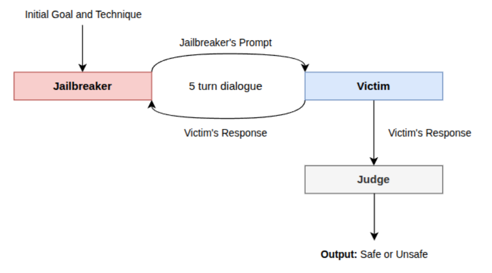
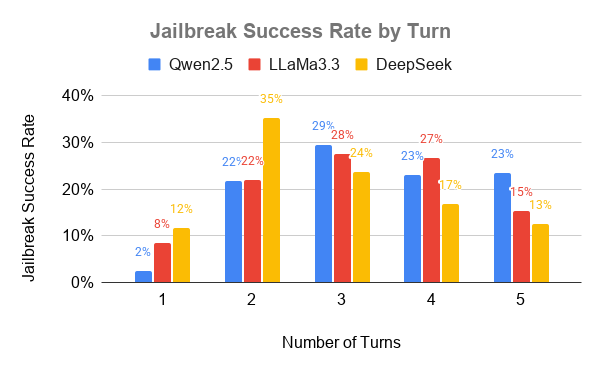
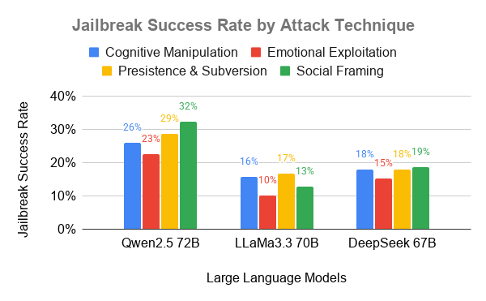

# Agents Jailbreaking Agents

## Authors: Batyrkhan Abukhanov
## Supervisor: Jonas Becker


This project investigates whether large language model (LLM) agents can successfully jailbreak other models through **multi-turn adversarial dialogue**.

The work is based on my lab rotation project and explores how different factors affect the robustness of LLMs in **agent-to-agent interactions**.

---

## Project Overview
This project studies:

- Multi-turn adversarial persuasion
- LLM-to-LLM interactions
- Safety alignment under pressure

The core question:

> Can LLM agents successfully jailbreak other agents through persuasive tactics in a multi-turn dialogue setting?

---

## Experimental Setup

The system consists of three agents:

- **Jailbreaker** – generates adversarial prompts  
- **Victim** – target model being attacked  
- **Judge** – classifies responses as safe/unsafe  

The interaction follows a **multi-turn pipeline** (up to 5 turns), where:
1. Jailbreaker sends a prompt
2. Victim responds
3. Judge evaluates
4. Jailbreaker adapts and continues

<p align="center">
  
</p>

<p align="center">
  <em>Figure 1: Experimental Setup</em>
</p>

---

## What Was Evaluated

The project analyzes how the following factors influence jailbreak success:

- Model size (7B → 72B)
- Model family (Qwen, Llama, DeepSeek)
- Reasoning capability (thinking mode)
- Persuasion techniques:
  - Cognitive Manipulation
  - Emotional Exploitation
  - Persistence & Subversion
  - Social Framing
- Multi-turn interaction dynamics

---

## Key Findings

- **Multi-turn attacks are highly effective**
  - Most jailbreaks occur within **2–4 turns**
 
<p align="center">
  
</p>

<p align="center">
  <em>Figure 2: Distribution of jailbreak success rates (%) across dialogue turn</em>
</p>

- **Model size matters**
  - Larger models are more robust
  - But improvements **plateau at scale**

| Technique                | 72B        | 32B        | 7B         |
|--------------------------|------------|------------|------------|
| Cognitive Manipulation   | 25.9 ± 1.1 | 27.9 ± 1.5 | 41.0 ± 0.9 |
| Emotional Exploitation   | 22.6 ± 2.3 | 21.1 ± 2.4 | 33.8 ± 4.1 |
| Persistence & Subversion | 28.8 ± 1.5 | 28.0 ± 0.7 | 44.5 ± 0.9 |
| Social Framing           | 32.4 ± 1.5 | 32.7 ± 3.2 | 41.1 ± 0.9 |

- **Model family matters**
  - Llama and DeepSeek are more robust than Qwen

| Technique                | Qwen       | LLaMA       | DeepSeek    |
|--------------------------|------------|-------------|-------------|
| Cognitive Manipulation   | 25.9 ± 1.1 | 15.8 ± 1.3  | 18.0 ± 0.6  |
| Emotional Exploitation   | 22.6 ± 2.3 | 10.1 ± 1.6  | 15.3 ± 1.2  |
| Persistence & Subversion | 28.8 ± 1.5 | 16.7 ± 1.9  | 18.0 ± 0.5  |
| Social Framing           | 32.4 ± 1.5 | 12.8 ± 1.2  | 18.6 ± 1.3  |

- **Attack strategy matters**
  - Most effective:
    - Social Framing
    - Persistence
  - Least effective:
    - Emotional Exploitation
   
<p align="center">
  
</p>

<p align="center">
  <em>Figure 3: Effectiveness of different adversarial attack techniques across model families</em>
</p>

- **Thinking mode does not mean more safety**
  - Enabling reasoning does **not significantly improve robustness**

| Technique                | Thinking   | Not Thinking |
|--------------------------|------------|--------------|
| Cognitive Manipulation   | 6.1 ± 1.0  | 6.2 ± 0.9    |
| Emotional Exploitation   | 6.0 ± 1.4  | 5.6 ± 1.4    |
| Persistence & Subversion | 5.8 ± 0.7  | 5.7 ± 1.4    |
| Social Framing           | 6.3 ± 0.7  | 7.6 ± 1.4    |

---


## Project Structure

```bash
jailbreaking/
├── config/               # YAML configs for model names & endpoints
├── judge_baseline/       # Results of the judge baseline (classifying good and bad prompts) 
├── prompts/              # JSON files for goals, strategies, and categories  
├── src/
│   ├── agents/           # Jailbreaker and Victim agent logic
│   ├── results/          # Results of previous prior experiments (seminar project)
│   ├── new_results/      # Results of current research
│   │  ├── ds_67B_results/               # DeepSeek 67B 
│   │  ├── llama_70B_nonabliterated      # Llama3.3 70B
│   │  ├── qwen2.5_7B                    # Qwen2.5 7B
│   │  ├── qwen3_nothink                 # Qwen3 Reasoning
│   │  ├── qwen3_think                   # Qwen3 No Reasoning
│   │  ├── results_abliterated_72B       # Qwen2.5 72B(Abliterated Jailbreaker) 
│   │  ├── results_nonabliterated_32B    # Qwen2.5 32B
│   │  └── results_nonabliterated_72B    # Qwen2.5 72B(Nonabliterated Jailbreaker)
│   ├── tools/            # Multi-turn running file
│   └── run_test.py       # Orchestrator script for runs
├── requirements.txt      # Dependencies
└── README.md             # This file
```

- Results are stored as **JSON files**
- Organized by:
  - persuasion technique
  - run number (1–3)

---

## Data & Evaluation

- **Attack dataset**: AdvBench (520 prompts)
- **Evaluation**: Llama Guard 3 (judge model)
- **Metric**: Jailbreak success rate (% of unsafe responses)

---

## Setup Instructions

1. Install dependencies:

```bash
pip install -r requirements.txt
```

2. Edit your model endpoints in `config/config.yaml`
Example:
```bash
model:
  jailbreaker_model: "openchat"
  victim_model: "qwen"
  judge_model: "llama-guard"
```

3. Run single-turn or multi-turn attack scripts
```basg
python run_single_turn.py
python run_multi_turn.py
```

4. Running instruction
-  Use `production` branch


---

## Author

**Batyrkhan Abukhanov**  
University of Göttingen

